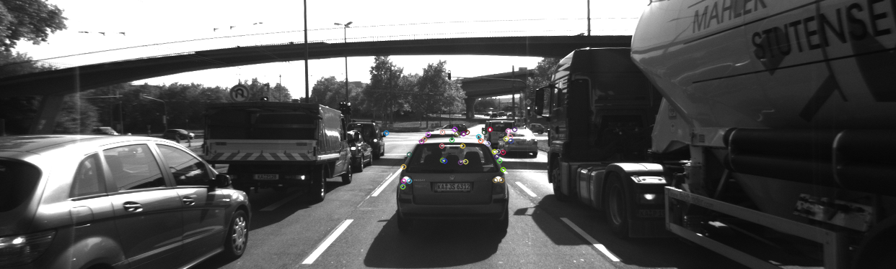
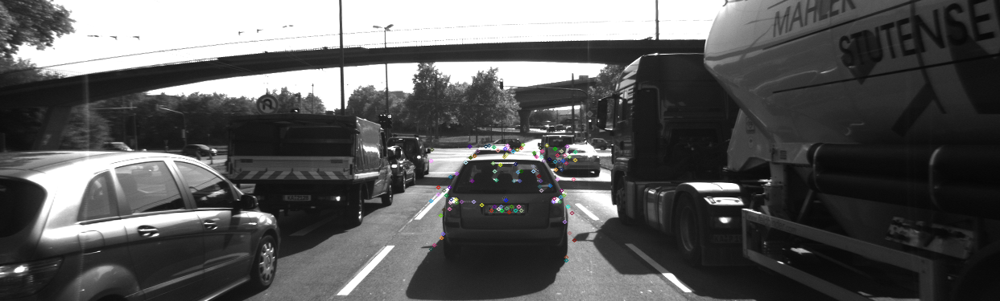
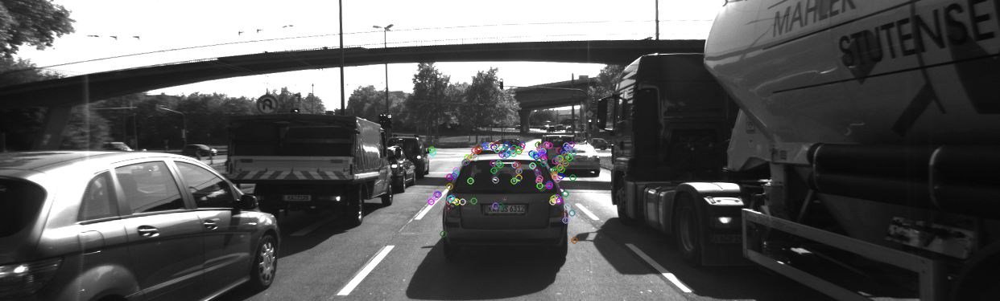
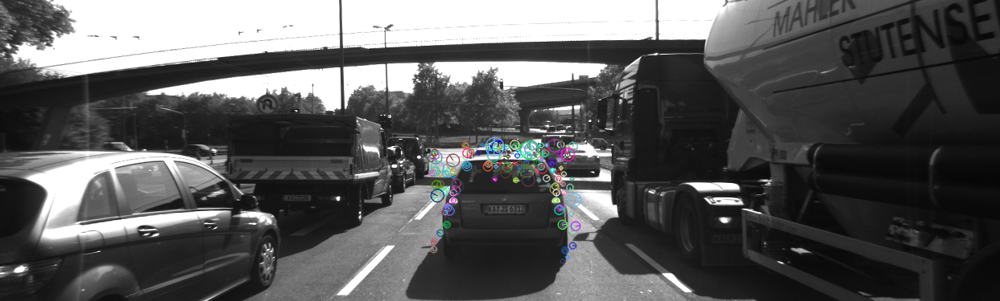
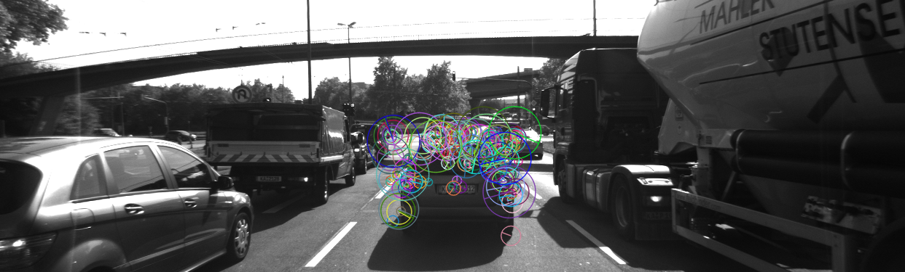
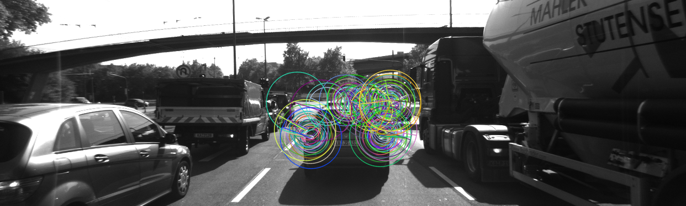
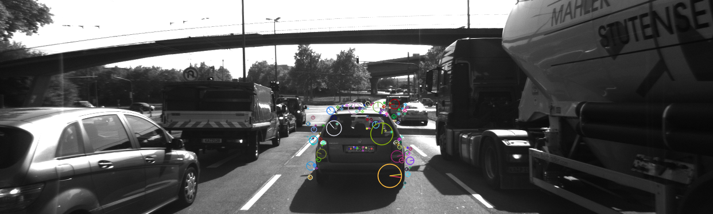

# SFND 2D Feature Tracking


The idea of the camera course is to build a collision detection system - that's the overall goal for the Final Project. As a preparation for this, you will now build the feature tracking part and test various detector / descriptor combinations to see which ones perform best. This mid-term project consists of four parts:

* First, you will focus on loading images, setting up data structures and putting everything into a ring buffer to optimize memory load. 
* Then, you will integrate several keypoint detectors such as HARRIS, FAST, BRISK and SIFT and compare them with regard to number of keypoints and speed. 
* In the next part, you will then focus on descriptor extraction and matching using brute force and also the FLANN approach we discussed in the previous lesson. 
* In the last part, once the code framework is complete, you will test the various algorithms in different combinations and compare them with regard to some performance measures. 

See the classroom instruction and code comments for more details on each of these parts. Once you are finished with this project, the keypoint matching part will be set up and you can proceed to the next lesson, where the focus is on integrating Lidar points and on object detection using deep-learning. 

## Dependencies for Running Locally
1. cmake >= 2.8
 * All OSes: [click here for installation instructions](https://cmake.org/install/)

2. make >= 4.1 (Linux, Mac), 3.81 (Windows)
 * Linux: make is installed by default on most Linux distros
 * Mac: [install Xcode command line tools to get make](https://developer.apple.com/xcode/features/)
 * Windows: [Click here for installation instructions](http://gnuwin32.sourceforge.net/packages/make.htm)

3. OpenCV >= 4.1
 * All OSes: refer to the [official instructions](https://docs.opencv.org/master/df/d65/tutorial_table_of_content_introduction.html)
 * This must be compiled from source using the `-D OPENCV_ENABLE_NONFREE=ON` cmake flag for testing the SIFT and SURF detectors. If using [homebrew](https://brew.sh/): `$> brew install --build-from-source opencv` will install required dependencies and compile opencv with the `opencv_contrib` module by default (no need to set `-DOPENCV_ENABLE_NONFREE=ON` manually). 
 * The OpenCV 4.1.0 source code can be found [here](https://github.com/opencv/opencv/tree/4.1.0)

4. gcc/g++ >= 5.4
  * Linux: gcc / g++ is installed by default on most Linux distros
  * Mac: same deal as make - [install Xcode command line tools](https://developer.apple.com/xcode/features/)
  * Windows: recommend using either [MinGW-w64](http://mingw-w64.org/doku.php/start) or [Microsoft's VCPKG, a C++ package manager](https://docs.microsoft.com/en-us/cpp/build/install-vcpkg?view=msvc-160&tabs=windows). VCPKG maintains its own binary distributions of OpenCV and many other packages. To see what packages are available, type `vcpkg search` at the command prompt. For example, once you've _VCPKG_ installed, you can install _OpenCV 4.1_ with the command:
```bash
c:\vcpkg> vcpkg install opencv4[nonfree,contrib]:x64-windows
```
Then, add *C:\vcpkg\installed\x64-windows\bin* and *C:\vcpkg\installed\x64-windows\debug\bin* to your user's _PATH_ variable. Also, set the _CMake Toolchain File_ to *c:\vcpkg\scripts\buildsystems\vcpkg.cmake*.


## Basic Build Instructions

1. Clone this repo.
2. Make a build directory in the top level directory: `mkdir build && cd build`
3. Compile: `cmake .. && make`
4. Run it: `./2D_feature_tracking`.


## Camera Based 2D Feature Tracking Project
The  objective of this project is to tracking the keypoints of proceeding vehilcles in order to caculate the TTC(Time To Collission). The mid-term report focuses on evaluation of the common detectors und descriptors for the purpose of selection the best commbinaiton to archieve real-time and high accuracy tracking task.


## MP.1 Data Buffer Optimization
DataBuffer is a vector which records congurous data. To achieve ring shifting, just erease the first elements whenever the size of DataBuffer has exceeded the defined dataBufferSize. Implementation is done as follow:
```c++
//Keeping only at most defined dataBufferSize frames in the data buffer.
if(dataBuffer.size()==dataBufferSize){
        // vector is contiguous array, elements are  conautomaticaly shifted to left, when the  first position is deleted.
    dataBuffer.erase(dataBuffer.begin());
}
dataBuffer.push_back(frame);

```

## MP.2 Keypoints Detection
Implement detectors HARRIS, FAST, BRISK, ORB, AKAZE, and SIFT and make them selectable by setting a string accordingly.
Ingeneral the detector works as follows, 1. load image as graysacle 2. Depends on the corner detection method to detect the keypoints, in Harris and Shi-Thomas use the gradient from x/y direction, in FAST use the direct comparison of pixel intencity with neighboors. 3. Use Non Maxima Susspression to reduce the less likely points.
## Harris Detector with NMS
This code is from the previous excise. 
```c++
void detKeypointsHarris(vector<cv::KeyPoint> &keypoints, cv::Mat &img, bool bVis)
{   
    // Detector parameters
    int blockSize = 2;     // for every pixel, a blockSize × blockSize neighborhood is considered
    int apertureSize = 3;  // aperture parameter for Sobel operator (must be odd)
    int minResponse = 100; // minimum value for a corner in the 8bit scaled response matrix
    double k = 0.04;       // Harris parameter (see equation for details)

    // Detect Harris corners and normalize output
    cv::Mat dst, dst_norm, dst_norm_scaled;
    dst = cv::Mat::zeros(img.size(), CV_32FC1);
    // Apply corner detection

    //double t = (double)cv::getTickCount();
    cv::cornerHarris(img, dst, blockSize, apertureSize, k, cv::BORDER_DEFAULT);
    cv::normalize(dst, dst_norm, 0, 255, cv::NORM_MINMAX, CV_32FC1, cv::Mat());
    cv::convertScaleAbs(dst_norm, dst_norm_scaled);
    //const int sw_size = 7;
    //const int sw_dist = sw_size / 2;
    const int windowSize = apertureSize * 2 + 1;
    const int col = dst_norm_scaled.cols;
    const int row = dst_norm_scaled.rows;

    // iterate all the points inside the boundery
    if(col >= windowSize && row >= windowSize){ // the image row and col size should at least greater that windowSize

        for(int ci = apertureSize; ci<row-apertureSize-1; ci++){
            for(int cj = apertureSize; cj<col-apertureSize-1; cj++){  // iterate all the central pixels (i,j)

                //define the keyPoint value which is equal the current one
                bool stop = false;
                unsigned char min_val = static_cast<unsigned char>(minResponse);
                unsigned char max_val = dst_norm_scaled.at<unsigned char>(ci,cj);
                if(dst_norm_scaled.at<unsigned char>(ci,cj) > min_val)
                {
                    for(int ni = ci-apertureSize; ni < ci+apertureSize; ni++){
                        for(int nj = cj- apertureSize ; nj<cj + apertureSize; nj++){
                            // iterate all the points in the window

                            // if  one of the response > central point, record this value and break, otherwise continue
                            if( dst_norm_scaled.at<unsigned char>(ni,nj)>max_val  ){

                                max_val = dst_norm_scaled.at<unsigned char>(ni,nj);
                                stop = true;
                                break;
                            }
                        }
                        if(stop){
                            break;
                        }
                    }
                    if(dst_norm_scaled.at<unsigned char>(ci,cj) == max_val){
                        keypoints.emplace_back(cj, ci , 2 * apertureSize, -1, max_val);
                    }
                }
            }
        }

    }
```

### Modern Detector FAST, BRISK, ORB, AKAZE, and SIFT
```c++
void detKeypointsModern(std::vector<cv::KeyPoint> &keypoints, cv::Mat &img, std::string detectorType, bool bVis)
{
    //create  a detector
    // reference from :
    cv::Ptr<cv::FeatureDetector> detector;

    if(detectorType == "BRISK"){
        detector = cv::BRISK::create();
    }else if(detectorType == "ORB"){
        detector = cv::ORB::create();

    }else if(detectorType == "AKAZE"){
        detector = cv::AKAZE::create();
        
    }else if(detectorType == "FAST"){
        const int threshold = 30;
        const bool bNMS = true;
        detector = cv::FastFeatureDetector::create(threshold,bNMS,cv::FastFeatureDetector::TYPE_9_16);
    }else if(detectorType == "SIFT"){
        detector = cv::xfeatures2d::SIFT::create();
    }

```


## MP.3 Keypoint Removal
Remove all keypoints outside of a pre-defined rectangle and only use the keypoints within the rectangle for further processing.

```c++
        /*Only keep keypoints on the preceding vehicle by filtering with rectanle box and  containing only keypoints only inside the rect box*/
        //S1: check if the keypoint inside the defined rectangle
        //S2: Push the keypoint into innerKeypoints vector, if S1 is true
        //S3: replace  the value of keypoints wiith innerKeypoints.
        bool bFocusOnVehicle = true;
        cv::Rect vehicleRect(535, 180, 180, 150);
        if (bFocusOnVehicle)
        {
             vector<cv::KeyPoint> innerKeypoints;
             for(auto kpt: keypoints){//iterates all the keypoints
                if(vehicleRect.contains(kpt.pt)){
                    innerKeypoints.push_back(kpt);
                }
             }
             keypoints = innerKeypoints;
        }
```

## MP.4 Keypoint Descriptors
Implement descriptors BRIEF, ORB, FREAK, AKAZE and SIFT and make them selectable by setting a string accordingly.
In general, the decriptors converts the detected keypoints into 128 or 256 bytes, which can easily to compare the similarity of the keypoints in different frames. In Opencv the BRISK, ORB, AKZE, BRIEF, SIEFT, FREAK are already implemented.
```c++

cv::Ptr<cv::DescriptorExtractor> extractor;
    if (descriptorType.compare("BRISK") == 0)
    {

        int threshold = 30;        // FAST/AGAST detection threshold score.
        int octaves = 3;           // detection octaves (use 0 to do single scale)
        double patternScale = 1.0; // apply this scale to the pattern used for sampling the neighbourhood of a keypoint.

        extractor = cv::BRISK::create(threshold, octaves, patternScale);
    }
    else if(descriptorType.compare("ORB") == 0)
    {
        extractor = cv::ORB::create();
    }else if(descriptorType.compare("AKAZE") == 0)
    {
        extractor = cv::AKAZE::create();
    }else if(descriptorType.compare("BRIEF") ==0){
        extractor = cv::xfeatures2d::BriefDescriptorExtractor::create();

    }else if(descriptorType.compare("SIFT") ==0){
        extractor = cv::xfeatures2d::SIFT::create();

    }else if(descriptorType.compare("FREAK") ==0){
        extractor = cv::xfeatures2d::FREAK::create();
    }

```


## MP.5 Descriptor Matching
Implement FLANN matching as well as k-nearest neighbor selection. Both methods must be selectable using the respective strings in the main function.
This is same  task from previous excise, only to  pay attention to the  openvv bugs with FLANN.
```c++

if (descSource.type() != CV_32F || descRef.type() != CV_32F )
{ // OpenCV bug workaround : convert binary descriptors to floating point due to a bug in current OpenCV implementation
    descSource.convertTo(descSource, CV_32F);
    descRef.convertTo(descRef, CV_32F);
}
    matcher = cv::DescriptorMatcher::create(cv::DescriptorMatcher::FLANNBASED);
```

## MP.6 Descriptor Distance Ratio
Use the K-Nearest-Neighbor matching to implement the descriptor distance ratio test, which looks at the ratio of best vs. second-best match to decide whether to keep an associated pair of keypoints.

```c++
vector< vector<cv::DMatch> > knn_matches;
matcher->knnMatch( descSource, descRef, knn_matches, 2 );
//-- Filter matches using the Lowe's ratio test, reference https://docs.opencv.org/3.4/d5/d6f/tutorial_feature_flann_matcher.html
double minDescDistRatio = 0.8;
for (auto it = knn_matches.begin(); it != knn_matches.end(); ++it)
{

    if ((*it)[0].distance < minDescDistRatio * (*it)[1].distance)
    {
        matches.push_back((*it)[0]);
    }
}
```


## MP.7 Performance Evaluation 1
Count the number of keypoints on the preceding vehicle for all 10 images and take note of the distribution of their neighborhood size. Do this for all the detectors you have implemented.


### Detected Keypoints Comparation

| Detector                | Detected Keypoints Num (Average from 10 frames) |   
| ----------------------  | -------------------------------------  | 
| SHI-TOMASI              |       117                              |   
| HARRIS                  |       27                               |  
| BRISK                   |       **276**                          |   
| ORB                     |       116                              | 
| AKAZE                   |      167                               |   
| FAST                    |       149                              |   
| SIFT                    |       138                              |   


### Kerpoints Distribution

In general, we can summary the dectected keypoints of the detectors as follows.

- Keypoints from Harris, Shi-Thomasi and FAST have relatiive smaller neighboor size . In partiiculart, due to the NMS(None Maxima Suppression), the keypoints from Harris detector are very sparse, almost no overlaping with adjacent keypoints.  Shi-Thomasi and Fast in comparison with other detectors als have less overlapped keypoits.
- Keypoints from AKAZE have relative bigger neighboor size in comparison with Harris, Shi-Thomas and FAST, but still smaller than other detectors. Some keypoints are slightly overlapped.
- Keypoints from BRISK and ORB have bigger neighboor size in comparison to other detectors. The keypoints from BRISK and ORB are obviously overlapped.
- Keypoits from SIFT have diverse neighboor size. Some keypoints are tiny size which can be small as keypoints from Shi-Thomas. On the other hand, some keypoints are big as keypoints from BRISK. The keypoints from SIFT are sliightly overlapped. 

**HARRIS**



**SHITOMASI**



**FAST**



**AKAZE**



**BRISK**


**ORB**




**SIFT**




## MP.8 Performance Evaluation 2
Count the number of matched keypoints for all 10 images using all possible combinations of detectors and descriptors. In the matching step, the BF approach is used with the descriptor distance ratio set to 0.8.
### Matached keypoits Comparation


| Matched keypoints       |            |         |         |          |         |         |
| ----------------------- | ---------  | -----   | -----   |  -----   |  -----  | -----   |
| **Detector\Descriptor** |   BRISK    |BRIEF    |  FREAK  |  ORB     |  AKAZE  |  SIFT   |
| SHI-TOMASI              |   76       |      90 |  64     | 85       | x       |103      |
| BRISK                   | **146**    | **151** |  **125**| **106**  | x       |**184**  |
| HARRIS                  |   14       |      17 |  14     | 17       | x       |19       |
| ORB                     |   72       |      50 |  38     | 58       | x       |85       |
| AKAZE                   |   x        |      x  |   x     | x        | 130     |x        |
| FAST                    |   87       |      98 |  74     | 96       | x       |116      |
| SIFT                    |   60       |      66 |  56     | x        | x       |89       | 


## MP.9 Performance Evaluation 3
Log the time it takes for keypoint detection and descriptor extraction. The results must be entered into a spreadsheet and based on this data, the TOP3 detector / descriptor combinations must be recommended as the best choice for our purpose of detecting keypoints on vehicles.

### Detector Computation Time Comparation

| Detector                | Mean Value of the Detected Keypoints in ms |   
| :---------------------- | -------------------------------------   | 
| SHI-TOMASI              |      24.94544                       |   
| HARRIS                  |      28.83144                       |  
| BRISK                   |      402.725                        |   
| ORB                     |      14.18506                       | 
| AKAZE                   |      138.525                        |   
| FAST                    |      **1.376802**                   |   
| SIFT                    |      191.7705                       |   


### Descriptor Computation time under with comibination of different detectors

| Descriptor Computation time | (ms)    |             |         |           |         |        |
| ----------------------- | ----------- | ----------- | ------- | -------   | ------- |------- |
| **Detector/Descriptor** | BRISK       |    BRIEF    | FREAK   |      ORB  |     AKAZE  | SIFT   |
| SHI-TOMASI              | 359.904     |    2.2421   |  63.952 |  2.5717   |    x       | 42.9977 |
| HARRIS                  | 352.206     |    1.5727   |  62.6767|  2.74     |    x       | 40.9623 |
| BRISK                   | 349.741     |    2.542    |  63.8846|  9.589    |    x       | 96.8125 |
| ORB                     | 359.194     |   **1.9494**|  56.23  |  10.2808  |    x       | 98.07   |
| AKAZE                   | x           |    x        |  x      |  x        |   126.246  | x       |
| FAST                    | 346.17      |    2.98584  |  66.5977| 3.82083   |    x       | 55.6013 |
| SIFT                    | 396.18      |     2.24    |  67.4073|  x        |    x       | 131.478 |

### Total computation time(detector,descriptor, matchiing) under different combinations
    
| Total Computation time | (ms)        |             |         |                |         |          |
| ----------------------- | ----------- | ----------- | ------- | -------       | ------- |------- |
| **Detector/Descriptor** | BRISK       |    BRIEF    | FREAK   |      ORB      |     AKAZE  | SIFT   |
| SHI-TOMASI              | 395.347     |  28.4186    |  84.6167 | 30.7807      |    x       | 70.2758 |
| HARRIS                  | 385.666     |  32.6508    |  87.0453 | 32.5393      |    x       | 72.3688 |
| BRISK                   | 747.668     |  422.953    |  468.285 | 407.415      |    x       | 520.753 |
| ORB                     | 377.983     |**17.4528**  |  69.4413 | 26.7971      |    x       | 116.564 |
| AKAZE                   | x           |  x          |  x       | x            |   269.175  | x       |
| FAST                    | 350.173     | **2.76917** |  70.9162 | **7.81895**  |    x       | 60.4042 |
| SIFT                    | 602.565     |  189.116    |  275.986 | x            |    x       | 309.425 |


### Top 3 combinations of detector and descriptor
Real-time is the most important metric for tracking vehicles. Consider to this factor, the combination has fast speed and highst matched keypoins will be the best chioce.

- Top1: Detector: FAST, Descriptor: BRIEF (Fastest combination, able to detect sufficient keypoints)
- Top2: Dectetor: FAST, Descriptor: ORB (higher speed, able to detect sufficient keypoints )
- Top3: Detector: ORB, Descriptor: BRIEF (high speed, able to detect sufficient keypoints )


